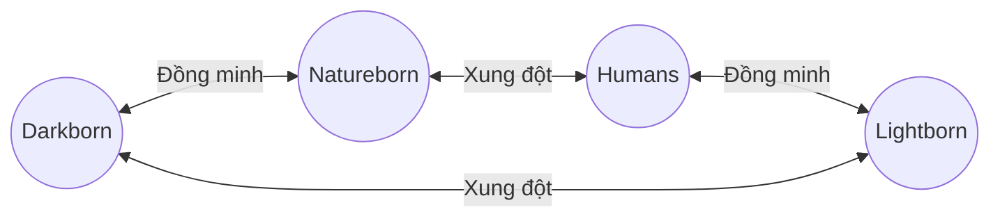

# 06. Chủng Tộc Card

Bốn chủng tộc chính thức là **Darkborn**, **Lightborn**, **Natureborn** và **Humans**. Đây là cấp phân loại cao nhất của toàn bộ hệ thống card; mọi nhóm như Elf, Goblin, Undead hay Demon đều là tộc nhánh thuộc một trong bốn chủng tộc này.

## Vòng Quan Hệ Giữa Các Chủng Tộc

Sơ đồ chỉ mô tả quan hệ bối cảnh giữa bốn race; đây không phải quy tắc khắc chế gameplay.

| Race A | Race B | Quan hệ |
|---|---|---|
| Darkborn | Lightborn | Xung đột |
| Darkborn | Natureborn | Đồng minh |
| Darkborn | Humans | Trung lập |
| Lightborn | Natureborn | Trung lập |
| Lightborn | Humans | Đồng minh |
| Natureborn | Humans | Xung đột |

Chỉ quan hệ được xác nhận ở cấp toàn race mới được gắn `Đồng minh` hoặc `Xung đột`. Các va chạm hay hợp tác của một giáo đoàn, cộng đồng hoặc cá nhân không thay đổi quan hệ `Trung lập` giữa toàn bộ hai race.

## Darkborn

**Darkborn** là tên gọi chung cho những sinh linh có nguồn gốc hoặc sức mạnh gắn với bóng tối, hư vô, tử giới và các dạng linh lực biến đổi. Darkborn không mặc nhiên đại diện cho cái ác: trong số họ có những người bảo vệ, học giả, chiến binh, kẻ lưu vong và cả các thế lực theo đuổi tham vọng riêng. Undead, Demon và những thực thể mang bản chất tương tự đều có thể thuộc Darkborn.

- Bản sắc chiến đấu: điều khiển linh lực, chuyển hóa, hồi sinh, đánh đổi tài nguyên và sức mạnh tăng tiến.
- Tộc nhánh hiện có: Undead, Demon.
- Thư mục card: [`cards/darkborn/undead/`](cards/darkborn/undead/) và [`cards/darkborn/demon/`](cards/darkborn/demon/).
- Quan hệ: Natureborn — Đồng minh; Lightborn — Xung đột; Humans — Trung lập.
  - Đồng minh với Natureborn: cả hai tôn trọng chu kỳ sinh tử và sử dụng linh lực gắn với tự nhiên hoặc linh hồn.
  - Xung đột với Lightborn: linh lực bóng tối, tử giới và chuyển hóa của Darkborn đối lập với ánh sáng, thanh tẩy và trật tự linh giới của Lightborn.

## Lightborn

**Lightborn** là những sinh linh gắn với ánh sáng và trật tự linh giới. Họ duy trì sự sống bằng khả năng chữa lành, thanh tẩy và bảo hộ đồng minh. Light Elf là một tộc nhánh của Lightborn.

- Bản sắc chiến đấu: hồi phục, bảo hộ, thanh tẩy và hỗ trợ.
- Tộc nhánh hiện có: Light Elf.
- Thư mục card: [`cards/lightborn/light_elf/`](cards/lightborn/light_elf/).
- Quan hệ: Humans — Đồng minh; Darkborn — Xung đột; Natureborn — Trung lập.
  - Đồng minh với Humans: cả hai coi trọng trật tự, tri thức, bảo hộ và một đội hình phối hợp.
  - Xung đột với Darkborn: thanh tẩy và bảo hộ của Lightborn đối lập với các sức mạnh bóng tối, tử giới và linh hồn của Darkborn.

## Natureborn

**Natureborn** là các bộ tộc hình thành từ sức sống hoang dã và linh lực nguyên thủy của tự nhiên. Họ chiến đấu bằng bản năng, nghi lễ bộ tộc, độc dược và totem. Goblin là một tộc nhánh của Natureborn.

- Bản sắc chiến đấu: totem, bẫy, đánh úp và hiệu ứng theo đội hình.
- Tộc nhánh hiện có: Goblin.
- Thư mục card: [`cards/natureborn/goblin/`](cards/natureborn/goblin/).
- Quan hệ: Darkborn — Đồng minh; Humans — Xung đột; Lightborn — Trung lập.
  - Đồng minh với Darkborn: Natureborn tôn trọng chu kỳ sinh tử, còn Darkborn gắn với linh lực chuyển hóa và hồi sinh.
  - Xung đột với Humans: việc mở rộng lãnh thổ, khai thác tài nguyên và phát triển công nghệ của Humans đe dọa vùng đất hoang dã của Natureborn.

## Humans

**Humans** không sở hữu nguồn sức mạnh bẩm sinh áp đảo, nhưng nổi bật nhờ ý chí, kỹ thuật và khả năng thích nghi. Họ kết hợp võ thuật, chiến thuật và công nghệ để tạo ra đội hình cân bằng.

- Bản sắc chiến đấu: phối hợp đội hình, phòng thủ, phản công và triệu gọi công nghệ.
- Tộc nhánh hiện có: các cộng đồng và chiến binh loài người.
- Quan hệ: Lightborn — Đồng minh; Natureborn — Xung đột; Darkborn — Trung lập.
  - Đồng minh với Lightborn: Humans nhận được tri thức và năng lực bảo hộ, còn Lightborn có một đồng minh đề cao trật tự và phối hợp đội hình.
  - Xung đột với Natureborn: việc mở rộng lãnh thổ, khai thác tài nguyên và phát triển công nghệ của Humans va chạm với quy luật tự nhiên và lãnh địa của Natureborn.

## Quy Ước Phân Loại Card

Mỗi card phải thuộc đúng một chủng tộc chính:

| Chủng tộc chính | Tộc nhánh hiện có | Định danh kỹ thuật hiện hành |
|---|---|---|
| Darkborn | Undead, Demon | `darkborn`, `undead`, `demon` |
| Lightborn | Light Elf | `elf`, `light_elf` |
| Natureborn | Goblin | `goblin` |
| Humans | Human | `human` |

Tên chủng tộc chính thức trong nội dung và tài liệu luôn dùng tiếng Anh: **Darkborn**, **Lightborn**, **Natureborn**, **Humans**. Chủng tộc mô tả nguồn gốc, văn hóa hoặc bản chất sức mạnh, không quyết định một Character là thiện hay ác. Các quan hệ trong tài liệu này mô tả bối cảnh ở cấp race, không tạo ưu thế chỉ số hay quy tắc khắc chế gameplay. Các định danh kỹ thuật cũ được giữ nguyên cho đến khi dữ liệu và script được migrate; chúng không tạo thêm chủng tộc chính.
