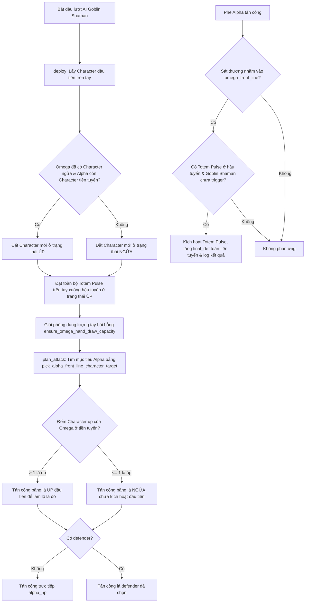

# Chiến thuật AI Goblin Shaman

> Phân loại: Normal Enemy
>
> Enemy key: `goblin_shaman`
>
> Script chính: [`enemy_ai_goblin_shaman.lua`](../../../../SaiGame/LuaScript/Scripts/enemy_ai_goblin_shaman.lua)

## Tổng quan

AI Goblin Shaman ([`enemy_ai_goblin_shaman.lua`](../../../../SaiGame/LuaScript/Scripts/enemy_ai_goblin_shaman.lua)) xây dựng một chiến thuật phòng thủ và che giấu thông tin kết hợp với việc bảo vệ tiền tuyến bằng Totem:

1. **Triển khai tiền tuyến**: Mỗi lượt deploy tối đa 1 Character. Nếu Omega đã có ít nhất 1 Character ngửa và Alpha còn Character trên tiền tuyến, Character mới triển khai sẽ giữ úp (`face_up = false`).
2. **Triển khai hậu tuyến**: Đặt toàn bộ lá `totem_pulse` trên tay vào hậu tuyến ở trạng thái úp (`face_up = false`, `expose = false`).
3. **Phòng thủ phản ứng (`defend`)**: Sử dụng helper dùng chung `enemy_ai_core.defend_with_back_line_ability_when_front_line_takes_damage` để tự động kích hoạt `totem_pulse` nâng DEF cho toàn tiền tuyến khi tiền tuyến Omega sắp chịu sát thương.
4. **Tấn công chiến thuật (`plan_attack`)**: Duy trì quy tắc "giữ lại đúng 1 Character úp". Khi có nhiều hơn 1 Character úp ở tiền tuyến, AI chọn lật một lá úp dư thừa để tấn công.

---

## 1. Triển khai đội hình (`deploy`)

Phần xử lý chính nằm trong hàm `deploy(state)` [`enemy_ai_goblin_shaman.lua:L31-L112`](../../../../SaiGame/LuaScript/Scripts/enemy_ai_goblin_shaman.lua#L31-L112).

### Kiểm tra trạng thái bàn đấu

- Kiểm tra `has_face_up_character`: Quét `omega_front_line` xem có lá Character nào đang lật ngửa (`face_up == true`) hay không.
- Đếm `alpha_front_line_character_count`: Quét `alpha_front_line` đếm số lượng Character của phe Alpha.

### Triển khai Tiền tuyến (Front Line)

- Phân tách bài trên tay (`omega_hand`), lấy danh sách Character.
- Nếu có từ 1 lá Character trở lên trên tay:
  - Chọn lá Character đầu tiên (`character_cards[1]`).
  - Xác định trạng thái úp/ngửa: `face_up = not (has_face_up_character and alpha_front_line_character_count > 0)`.
    - Lật ngửa (`face_up = true`) nếu Omega chưa có Character ngửa NÀO hoặc Alpha đã hết Character ở tiền tuyến.
    - Giữ úp (`face_up = false`) nếu Omega đã có ít nhất 1 Character ngửa VÀ Alpha vẫn còn Character ở tiền tuyến.
  - Đặt vào slot trống đầu tiên ở `omega_front_line`.

### Triển khai Hậu tuyến (Back Line)

- Lọc tất cả các lá `totem_pulse` có trên tay.
- Lần lượt đưa từng lá `totem_pulse` vào slot trống của `omega_back_line`.
- Mọi lá `totem_pulse` khi deploy đều được đặt ở trạng thái úp (`face_up = false`, `expose = false`).

### Bảo đảm dung lượng rút bài & dọn dẹp

- Gọi `lib_battle_ai.ensure_omega_hand_draw_capacity(...)` để giải phóng đủ chỗ trên tay cho lượt rút bài tiếp theo của Omega.
- Tái tạo lại tay bài (`_rebuild_hand`), ghi nhận các client action (`_append_mid_deploy_actions`), và reset trạng thái bài đã deploy (`_reset_deployed_cards`).

---

## 2. Phản ứng phòng thủ (`defend`)

Phần xử lý phòng thủ nằm trong hàm `defend(state)` [`enemy_ai_goblin_shaman.lua:L17-L26`](../../../../SaiGame/LuaScript/Scripts/enemy_ai_goblin_shaman.lua#L17-L26).

Hàm gọi helper `enemy_ai_core.defend_with_back_line_ability_when_front_line_takes_damage(state, "totem_pulse", "goblin_shaman")`:

```lua
function defend(state)
    lib_battle_common.dlog("[entity_ai] == goblin_shaman.defend ==")
    local ability_err = enemy_ai_core.defend_with_back_line_ability_when_front_line_takes_damage(
        state, "totem_pulse", "goblin_shaman"
    )
    if ability_err ~= nil then return ability_err end
    goblin_shaman_log_front_line_def(state.omega_front_line or {}, "omega")
    return nil
end
```

### Điều kiện kích hoạt Totem Pulse

Phản ứng chỉ xảy ra khi thỏa mãn toàn bộ các điều kiện trong `enemy_ai_core`:
1. `state.pending_attack` tồn tại và `damage_dealt > 0`.
2. Mục tiêu chịu đòn (`defender_inventory_item_id`) nằm trên `omega_front_line`.
3. Hậu tuyến `omega_back_line` có lá `totem_pulse` (ưu tiên lá đã lộ trước, sau đó mới đến lá úp).
4. Tiền tuyến `omega_front_line` có ít nhất một lá `goblin_shaman` chưa kích hoạt (`trigger ~= true`).

Khi kích hoạt thành công, Totem lật ngửa, Goblin Shaman bị đánh dấu `trigger = true`, cộng `def_added` của Totem vào `final_def` của toàn bộ Character trên `omega_front_line`, sau đó lá Totem được chuyển vào `omega_the_void`. Log ghi nhận `final_def` của tiền tuyến qua `goblin_shaman_log_front_line_def`.

---

## 3. Lập kế hoạch tấn công (`plan_attack`)

Phần xử lý tấn công nằm trong hàm `plan_attack(state)` [`enemy_ai_goblin_shaman.lua:L142-L182`](../../../../SaiGame/LuaScript/Scripts/enemy_ai_goblin_shaman.lua#L142-L182).

### Chọn mục tiêu phòng thủ (Defender)

Hàm sử dụng `enemy_ai_core.pick_alpha_front_line_character_target(state)`:
1. Ưu tiên chọn Character ngửa (`face_up == true`) trên `alpha_front_line` có chỉ số **DEF còn lại** (`final_def - total_damage_received`) thấp nhất.
2. Nếu không có Character ngửa, chọn Character úp đầu tiên theo thứ tự slot trên `alpha_front_line`.
3. Nếu `alpha_front_line` không còn Character nào, `defender` trả về `nil` (chuyển sang tấn công trực tiếp `alpha_hp`).

### Chọn đơn vị tấn công (Attacker)

Hàm kiểm tra số lượng Character úp chưa kích hoạt trên `omega_front_line` qua `goblin_shaman_find_extra_face_down_attacker(state)`:
- **Nếu `face_down_count > 1`**: Chọn lá Character úp đầu tiên làm `attacker`. Việc tấn công sẽ lật ngửa lá này, giữ cho số lượng Character úp trên tiền tuyến luôn duy trì tối đa 1 lá.
- **Nếu `face_down_count <= 1`**: Lấy Character ngửa chưa kích hoạt đầu tiên qua `lib_battle_ai._find_omega_attacker(state, true)`.
- **Nếu không tìm thấy `attacker` hợp lệ**: Gọi `lib_battle_ai.omega_end_turn(state)` và kết thúc lượt ngay lập tức.

### Tạo hành động tấn công

- Nếu `defender == nil`: Thêm action `omega_attack_alpha_hp` vào `state.omega_planning` và gửi client action tương ứng.
- Nếu `defender != nil`: Thêm action `card_attack_card` với `attacker_inv_id` và `defender_inv_id` vào `state.omega_planning` và gửi client action tương ứng.

---

## Sơ đồ luồng quyết định



---

## Tóm tắt thuật toán Lua

```text
DEPLOY:
  1. Phân loại bài trên tay.
  2. Deploy 1 Character vào slot trống tiền tuyến đầu tiên.
     - face_up = false nếu (Omega đã có Character ngửa AND Alpha còn Character tiền tuyến).
     - face_up = true cho các trường hợp còn lại.
  3. Deploy toàn bộ totem_pulse vào slot trống hậu tuyến (face_up = false).
  4. Phải gọi ensure_omega_hand_draw_capacity để giữ chỗ rút bài lượt sau.

DEFEND:
  1. Kiểm tra pending_attack có sát thương vào omega_front_line hay không.
  2. Kích hoạt totem_pulse từ hậu tuyến nếu tiền tuyến có goblin_shaman chưa trigger.
  3. Cộng final_def cho toàn bộ tiền tuyến và log thông tin def sau khi buff.

PLAN ATTACK:
  1. Chọn mục tiêu Alpha: Ưu tiên Character ngửa có DEF còn lại thấp nhất -> Character úp -> alpha_hp.
  2. Đếm số Character úp của Omega trên tiền tuyến.
     - Nếu > 1: Chọn lá úp đầu tiên làm attacker (quy tắc duy trì tối đa 1 lá úp).
     - Nếu <= 1: Chọn lá ngửa chưa trigger làm attacker.
  3. Nếu không có attacker hợp lệ: Gọi omega_end_turn.
```
