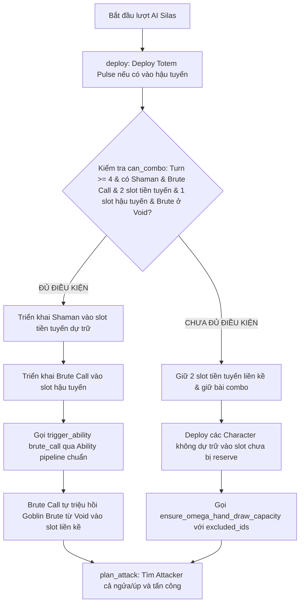

# Chiến thuật AI Silas

## Thông Tin Enemy

> Trạng thái: Đã triển khai AI
>
> Phân loại tài liệu: Normal Enemy
>
> Entity type trong cấu hình: NPC
>
> Enemy key: `silas`
>
> Script chính: [`enemy_ai_silas.lua`](../../../../SaiGame/LuaScript/Scripts/enemy_ai_silas.lua)

> Lực chiến dự kiến:
>
> **10,110 điểm**
>
>   - Điểm bộ bài: 8,640
>   - Điểm choose: 1,020
>   - Điểm Void: 0
>   - Điểm chiến thuật: 450
>
> Xem [công thức dùng chung](../enemy_power_score.md#công-thức).

## Tổng quan

Silas ([`enemy_ai_silas.lua`](../../../../SaiGame/LuaScript/Scripts/enemy_ai_silas.lua)) triển khai chiến thuật combo kết hợp giữa việc giữ bộ bài triệu hồi `Goblin Brute` và phòng thủ phản ứng bằng `Totem Pulse`:

1. **Phòng thủ phản ứng (`defend`)**: Silas sử dụng `totem_pulse` để bảo vệ tiền tuyến khi bị tấn công thông qua cơ chế xử lý nội bộ độc lập (không phụ thuộc `enemy_ai_core`).
2. **Quản lý bộ Combo trên tay**: Dự trữ **một `goblin_shaman` và một `brute_call` trên tay**, duy trì **2 slot trống liền kề** ở tiền tuyến cho tới khi đủ điều kiện kích hoạt từ turn 4.
3. **Triển khai Combo triệu hồi**: Từ turn 4 trở đi, khi thỏa mãn điều kiện, Silas deploy Shaman vào slot tiền tuyến đã dự trữ, deploy Brute Call vào hậu tuyến và kích hoạt `brute_call` qua pipeline Ability tiêu chuẩn để triệu hồi `Goblin Brute` từ void.
4. **Triển khai ngoài combo**: Ưu tiên deploy ngay `totem_pulse` xuống hậu tuyến khi rút được, đồng thời cho phép các Character ngoài bộ dự trữ được deploy vào các slot chưa bị reserve.

---

## Cấu hình Entity & Bộ Bài

Theo dữ liệu entity Silas:

| Thuộc tính | Giá trị |
| --- | --- |
| Name | Silas |
| Rarity | Common |
| Type | NPC |
| Category | Normal Enemy |
| `choose_card_1` | `goblin_shaman` |
| `choose_card_2` | `brute_call` |
| `choose_card_3` | `goblin_saboteur` |
| Drop Pack IDs | Win Game Pack; Win Items |

Danh sách 27 card của Silas (9 loại, mỗi loại 3 bản):

| Card code | Số lượng | ATK | DEF | Điểm cơ bản | Vai trò |
| --- | ---: | ---: | ---: | ---: | --- |
| [`goblin_shaman`](../../cards/natureborn/goblin/goblin_shaman.md) | 3 | 200 | 310 | 1,530 | Character cho combo & trigger Totem |
| [`goblin_saboteur`](../../cards/natureborn/goblin/goblin_saboteur.md) | 3 | 230 | 280 | 1,530 | Character chiến đấu |
| [`skeleton`](../../cards/darkborn/undead/Ria/skeleton.md) | 3 | 50 | 160 | 630 | Character chiến đấu |
| [`goblin_grunt`](../../cards/natureborn/goblin/goblin_grunt.md) | 3 | 100 | 210 | 930 | Character chiến đấu |
| [`totem_pulse`](../../cards/natureborn/goblin/abilities/totem_pulse.md) | 3 | 0 | 0 | 0 | Ability phòng thủ; `def_added` được chấm ở chiến thuật |
| [`brute_call`](../../cards/natureborn/goblin/abilities/brute_call.md) | 3 | 0 | 0 | 0 | Ability triệu hồi; hiệu ứng được chấm ở chiến thuật |
| [`goblin_brute`](../../cards/natureborn/goblin/goblin_brute.md) | 3 | 310 | 470 | 2,340 | Character được triệu hồi từ Void |
| [`zombie_male`](../../cards/darkborn/undead/common/zombie_male.md) | 3 | 70 | 240 | 930 | Character chiến đấu |
| [`zombie_female`](../../cards/darkborn/undead/common/zombie_female.md) | 3 | 50 | 200 | 750 | Character chiến đấu |
| **Tổng** | **27** | **3,030** | **5,610** | **8,640** | Xem [cách tính lực chiến](../enemy_power_score.md) |

---

## 1. Phản ứng phòng thủ (`defend`)

Chi tiết mã nguồn nằm tại [`enemy_ai_silas.lua`](../../../../SaiGame/LuaScript/Scripts/enemy_ai_silas.lua):

Silas chủ động phòng thủ: Khi tiền tuyến Omega bị nhắm tới bởi một đòn đánh gây sát thương (`pending_attack.damage_dealt > 0`), nếu có `totem_pulse` ở hậu tuyến và `goblin_shaman` chưa kích hoạt trên tiền tuyến, Silas sẽ kích hoạt Totem Pulse nâng DEF toàn bộ tiền tuyến trước khi đòn đánh giải quyết.

---

## 2. Triển khai đội hình (`deploy`)

Chi tiết mã nguồn nằm tại [`enemy_ai_silas.lua`](../../../../SaiGame/LuaScript/Scripts/enemy_ai_silas.lua).

### Triển khai Totem Pulse sớm

- Khi rút được `totem_pulse`, Silas deploy ngay vào hậu tuyến (`omega_back_line`) ở trạng thái úp (`face_up = false`).
- Để đảm bảo còn chỗ cho `brute_call`, Silas kiểm tra `count_empty_slots(back_line) >= min_back_slots` (với `min_back_slots = 2` nếu đang cầm `brute_call`, ngược lại là `1`).

### Kiểm tra điều kiện Combo (`can_combo`)

Combo được phép thực thi khi **đồng thời** thỏa mãn 6 điều kiện:
1. `tonumber(state.turn or 0) >= 4` (từ Turn 4 trở đi).
2. Tay bài có `goblin_shaman`.
3. Tay bài có `brute_call`.
4. Tiền tuyến `omega_front_line` có 2 slot trống liền kề (`reserve_left ~= nil`).
5. Hậu tuyến `omega_back_line` còn ít nhất 1 slot trống cho `brute_call`.
6. `omega_the_void` có lá `goblin_brute`.

### Luồng thực thi Combo

Nếu `can_combo == true`:
1. Deploy `goblin_shaman` từ hand vào slot tiền tuyến `reserve_left` ở trạng thái úp (`face_up = false`).
2. Deploy `brute_call` từ hand vào slot trống ở hậu tuyến ở trạng thái úp (`face_up = false`).
3. Rebuild lại tay bài và cập nhật client actions.
4. Kích hoạt Ability `brute_call` thông qua pipeline chuẩn của `lib_ability_core`.
5. Hiệu ứng triệu hồi `goblin_brute` từ void được xử lý hoàn toàn bởi pipeline của Ability `brute_call`.

### Luồng triển khai trước/ngoài Combo

Nếu chưa thể thực hiện combo:
1. Xác định 2 slot trống liền kề trên tiền tuyến (`reserve_left`) để giữ lại cho combo.
2. Không deploy các card thuộc danh sách dự trữ: `shaman_card`, `brute_call_card`, và `goblin_brute`.
3. Có thể deploy các Character chiến đấu khác vào các slot tiền tuyến chưa bị reserve (`find_unreserved_empty_slot`).
4. Khi gọi `lib_battle_ai.ensure_omega_hand_draw_capacity`, Silas truyền danh sách `excluded_ids` (chứa các Character bị giữ lại) để việc giải phóng dung lượng tay bài không vô tình tiêu thụ bài dự trữ.

---

## 3. Lập kế hoạch tấn công (`plan_attack`)

Chi tiết mã nguồn nằm tại [`enemy_ai_silas.lua`](../../../../SaiGame/LuaScript/Scripts/enemy_ai_silas.lua):

Silas sử dụng luồng chọn quân tấn công và mục tiêu nội bộ:
1. **Tìm Attacker (`find_omega_attacker`)**: Tìm Character chưa kích hoạt trên tiền tuyến có ATK > 1. Cả thẻ ngửa và thẻ úp đều hợp lệ (ưu tiên thẻ ngửa trước nếu có, sau đó đến thẻ úp). Khi tấn công, hệ thống sẽ tự động lật ngửa (`expose`) thẻ úp.
2. **Chọn mục tiêu (`pick_alpha_front_line_character_target`)**: Ưu tiên Character ngửa trên `alpha_front_line` có lượng DEF còn lại thấp nhất mà tổng sát thương Omega có thể hạ gục. Nếu không đủ sát thương kết liễu, chọn lật thẻ úp của Alpha. Nếu Alpha không còn Character trên tiền tuyến, chuyển sang tấn công trực tiếp vào máu Alpha (`alpha_hp`).

---

## Sơ đồ luồng quyết định



---

## Tóm tắt thuật toán Lua

```text
DEFEND:
  Kích hoạt Totem Pulse từ hậu tuyến nâng DEF tiền tuyến khi bị tấn công.

DEPLOY:
  1. Rút được Totem Pulse -> Deploy ngay vào hậu tuyến (giữ slot cho Brute Call nếu cầm).
  2. Kiểm tra điều kiện combo (turn >= 4, có Shaman + Brute Call + Brute trong Void + đủ slot).
  3. Nếu đủ điều kiện:
     - Deploy Shaman úp vào front slot dự trữ.
     - Deploy Brute Call úp vào back slot.
     - Trigger Ability brute_call trên Shaman để triệu hồi Goblin Brute.
  4. Nếu chưa đủ điều kiện:
     - Dự trữ 2 slot tiền tuyến liền kề.
     - Chỉ deploy Character không thuộc nhóm reserve vào slot ngoài khu vực reserve.
     - Gọi ensure_omega_hand_draw_capacity ngoại trừ các lá reserved (dùng excluded_ids).

PLAN ATTACK:
  1. Tìm Attacker trên tiền tuyến (hỗ trợ cả thẻ úp, ưu tiên thẻ ngửa nếu có).
  2. Nếu Alpha có Character: tấn công mục tiêu tối ưu.
  3. Nếu Alpha không có Character: tấn công Alpha HP.
```
