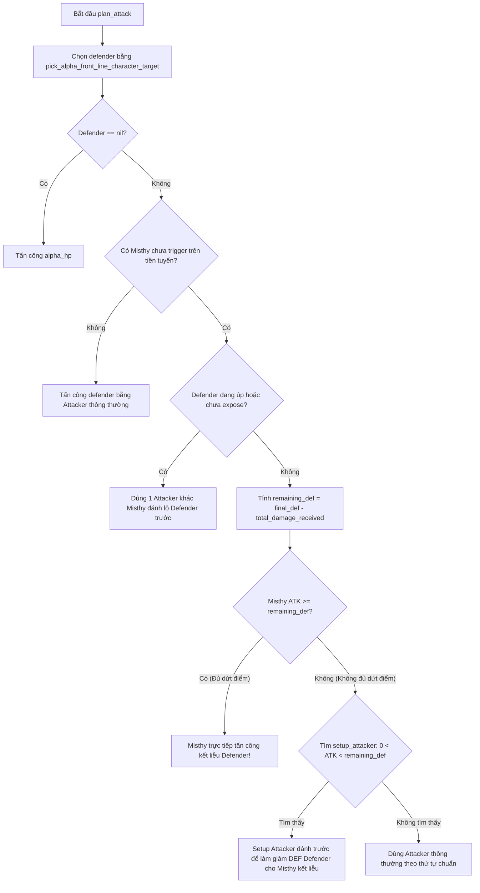

# Chiến thuật AI The Bent Spoon #1

> Trạng thái: Đã triển khai AI
>
> Phân loại tài liệu: Normal Enemy
>
> Entity type trong cấu hình: NPC
>
> Enemy key: `the_bent_spoon_1`
>
> Script chính: [`enemy_ai_the_bent_spoon_1.lua`](../../../../SaiGame/LuaScript/Scripts/enemy_ai_the_bent_spoon_1.lua)

## Tổng quan

`the_bent_spoon_1` ([`enemy_ai_the_bent_spoon_1.lua`](../../../../SaiGame/LuaScript/Scripts/enemy_ai_the_bent_spoon_1.lua)) triển khai chiến thuật phối hợp linh hoạt dựa trên ưu tiên lá bài và tính toán dồn sát thương kết liễu:

1. **Phòng thủ (`defend`)**: Không có phản ứng phòng thủ riêng (`defend(state)` trả về `nil`).
2. **Triển khai Ưu tiên (`deploy`)**:
   - **Giai đoạn Eagle Eye**: Kiểm tra nếu Alpha có Character tiền tuyến úp VÀ Omega có `Lyra` trên sân, AI ưu tiên deploy `eagle_eye` từ hand lên hậu tuyến ở trạng thái ngửa (`face_up = true`) và kích hoạt ngay Ability `eagle_eye` lên Character úp đó.
   - **Giai đoạn Triển khai Character**: Nếu không có combo Eagle Eye, AI deploy Character với thứ tự ưu tiên: `misthy` -> `lyra` -> các Character khác.
   - **Xác định Úp/Ngửa**: Nếu bàn đấu Omega đã có bài (`has_omega_deployed_card`), Character mới deploy sẽ lật ngửa (`face_up = true`); ngược lại deploy úp (`face_up = false`).
3. **Tính toán Tấn công Phối hợp Misthy (`plan_attack`)**: AI sở hữu thuật toán tính toán sát thương độc đáo dành riêng cho `Misthy` để thiết lập các pha kết liễu (kill-setup) tối ưu.

---

## Cấu hình Entity & Bộ Bài

Theo cấu hình NPC The Bent Spoon #1:

| Thuộc tính | Giá trị |
| --- | --- |
| Name | The Bent Spoon #1 |
| Rarity | Common |
| Type | NPC |
| Category | Normal Enemy |
| `choose_card_1` | `misthy` |
| `choose_card_2` | `abyssal_mist` |
| `choose_card_3` | `eagle_eye` |

Danh sách 27 card của The Bent Spoon #1 (9 loại, mỗi loại 3 bản):

| Card code | Số lượng | Vai trò |
| --- | ---: | --- |
| `misthy` | 3 | Character chủ lực dồn sát thương kết liễu |
| `lyra` | 3 | Character chiến đấu & trigger Eagle Eye |
| `eagle_eye` | 3 | Ability của Lyra lật bài úp đối phương |
| `abyssal_mist` | 3 | Ability hỗ trợ Misthy |
| `kira` | 3 | Character chiến đấu |
| `goblin_shaman` | 3 | Character chiến đấu |
| `skeleton` | 3 | Character chiến đấu |
| `zombie_male` | 3 | Character chiến đấu |
| `zombie_female` | 3 | Character chiến đấu |

---

## 1. Triển khai đội hình (`deploy`)

Chi tiết mã nguồn nằm tại [`enemy_ai_the_bent_spoon_1.lua:L142-L178`](../../../../SaiGame/LuaScript/Scripts/enemy_ai_the_bent_spoon_1.lua#L142-L178).

### Bước 1: Dàn dựng Eagle Eye (`stage_eagle_eye`)

Hàm [`enemy_ai_the_bent_spoon_1.lua:L70-L83`](../../../../SaiGame/LuaScript/Scripts/enemy_ai_the_bent_spoon_1.lua#L70-L83) kiểm tra:
1. Phe Alpha có Character tiền tuyến đang úp và chưa expose (`find_face_down_alpha_character`).
2. Phe Omega đã có `lyra` trên bàn đấu (`find_omega_line_card(state, "lyra")`).

Nếu cả 2 điều kiện thỏa mãn:
- Kiểm tra `eagle_eye` đã có trên bàn đấu hay chưa. Nếu chưa có, deploy 1 lá `eagle_eye` từ hand vào slot trống của `omega_back_line` ở trạng thái ngửa (`face_up = true`).
- Sau khi dọn dẹp dung lượng rút bài, AI kích hoạt `eagle_eye` thông qua `enemy_ai_core.trigger_ability_and_append_actions` với `trigger_event = "on_attack"` và mục tiêu là Character úp của Alpha.

### Bước 2: Deploy Character theo thứ tự ưu tiên (`deploy_priority_character`)

Nếu không có combo Eagle Eye, AI chọn 1 Character từ hand để deploy vào `omega_front_line` [`enemy_ai_the_bent_spoon_1.lua:L30-L51`](../../../../SaiGame/LuaScript/Scripts/enemy_ai_the_bent_spoon_1.lua#L30-L51):
- Thứ tự ưu tiên card code:
  1. `misthy`
  2. `lyra`
  3. Các Character khác theo thứ tự trên tay.
- Trạng thái úp/ngửa:
  - Kiểm tra `has_omega_deployed_card`: Nếu Omega đã có ít nhất 1 lá bài trên tiền tuyến hoặc hậu tuyến, Character mới deploy sẽ **lật ngửa** (`face_up = true`).
  - Nếu bàn đấu Omega hoàn toàn trống, Character mới deploy sẽ **giữ úp** (`face_up = false`).

### Bước 3: Đảm bảo dung lượng rút bài

Sau khi deploy, gọi `lib_battle_ai.ensure_omega_hand_draw_capacity(...)` để giải phóng dung lượng cho lượt rút bài kế tiếp.

---

## 2. Phản ứng phòng thủ (`defend`)

Chi tiết mã nguồn nằm tại [`enemy_ai_the_bent_spoon_1.lua:L85-L87`](../../../../SaiGame/LuaScript/Scripts/enemy_ai_the_bent_spoon_1.lua#L85-L87):

```lua
function defend(state)
    return nil
end
```

The Bent Spoon #1 không có phản ứng phòng thủ riêng.

---

## 3. Lập kế hoạch tấn công phối hợp Misthy (`plan_attack`)

Chi tiết mã nguồn nằm tại [`enemy_ai_the_bent_spoon_1.lua:L180-L240`](../../../../SaiGame/LuaScript/Scripts/enemy_ai_the_bent_spoon_1.lua#L180-L240).

### Quy trình chọn mục tiêu & tính toán sát thương



### Chi tiết các bước xử lý trong Lua

1. **Chọn Defender**: Sử dụng `enemy_ai_core.pick_alpha_front_line_character_target` (ưu tiên Character ngửa có DEF còn lại thấp nhất, sau đó đến Character úp). Nếu không có, đánh `alpha_hp`.
2. **Kiểm tra Misthy**: Tìm lá `misthy` chưa trigger trên `omega_front_line`. Nếu không có Misthy, tấn công theo quy trình thông thường.
3. **Lật ngửa Defender úp (Target Exposure)**:
   - Nếu `defender` đang úp (`face_up != true` hoặc `expose != true`), AI chọn 1 Attacker khác Misthy (`find_untriggered_non_misthy_attacker`) đánh vào mục tiêu trước để **lật ngửa Defender**, giúp các tính toán sát thương chính xác ở bước sau.
4. **Thuật toán Phối hợp Sát thương của Misthy**:
   - Tính **DEF còn lại** của mục tiêu: `remaining_def = defender.final_def - defender.total_damage_received`.
   - Tính **Sát thương của Misthy**: `misthy_damage = get_omega_character_attack_damage(state, misthy)`.
   - **Trường hợp 1 (Dứt điểm trực tiếp)**: Nếu `misthy_damage >= remaining_def`, Misthy tấn công dứt điểm mục tiêu ngay mà không cần quân hỗ trợ.
   - **Trường hợp 2 (Setup mồi sát thương)**: Nếu Misthy chưa đủ sát thương kết liễu, AI tìm một **Safe Setup Attacker** (`find_safe_misthy_setup_attacker`) là Character khác Misthy có sát thương `0 < damage < remaining_def`. Attacker này sẽ đánh trước làm suy giảm DEF của mục tiêu, đưa DEF của mục tiêu xuống ngưỡng để Misthy có thể kết liễu ở đòn sau!
   - **Trường hợp 3 (Fallback)**: Nếu không có setup attacker phù hợp, AI quay lại dùng attacker tiêu chuẩn từ `lib_battle_ai._find_omega_attacker`.

---

## Tóm tắt thuật toán Lua

```text
DEPLOY:
  1. Nếu Alpha có Character tiền tuyến úp VÀ Omega có Lyra -> Deploy Eagle Eye ngửa vào back line & trigger Ability ngay.
  2. Ngược lại -> Deploy Character theo ưu tiên: Misthy -> Lyra -> Character khác.
  3. Trạng thái Úp/Ngửa của Character: Ngửa nếu Omega đã có bài trên sân, Úp nếu bàn đấu hoàn toàn trống.
  4. Gọi ensure_omega_hand_draw_capacity.

DEFEND:
  Trả về nil (không phản ứng).

PLAN ATTACK (Thuật toán Misthy Finish):
  1. Chọn Defender Alpha bằng pick_alpha_front_line_character_target.
  2. Nếu không có Defender -> Đánh alpha_hp.
  3. Nếu Defender đang úp -> Dùng Character khác Misthy đánh trước để làm lộ Defender.
  4. Nếu Defender ngửa & có Misthy trên tiền tuyến:
     - misthy_damage >= remaining_def -> Misthy đánh kết liễu luôn.
     - misthy_damage < remaining_def -> Tìm Character có (0 < damage < remaining_def) đánh trước để bào DEF cho Misthy dứt điểm.
  5. Nếu không thỏa các điều kiện trên -> Tấn công bằng Attacker thông thường.
```
