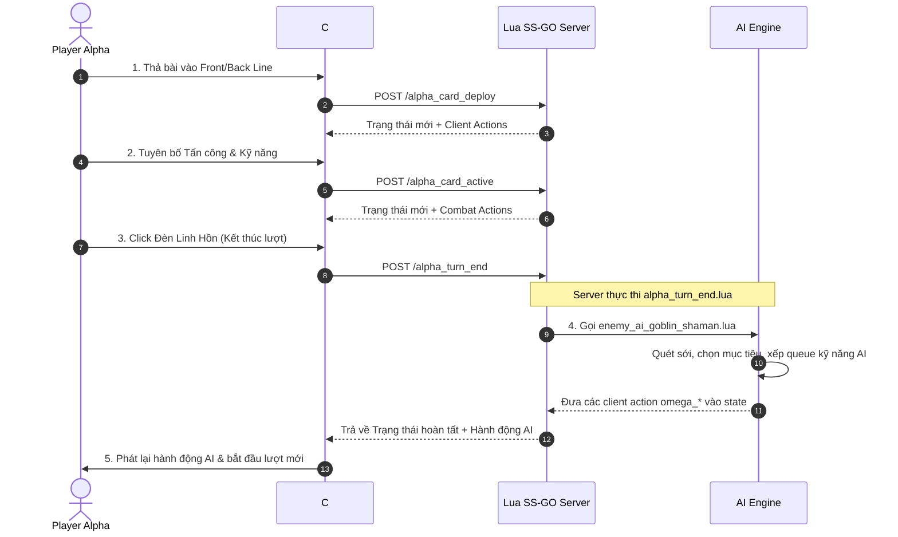

# Tổng Quan & Cơ Chế Chế Độ PvE

> [!NOTE]
> **Phạm vi**: Tài liệu này bao gồm các cơ chế, luồng kịch bản và tích hợp AI **dành riêng cho chế độ PvE (Player vs. Environment)**. Đối với luật chơi cốt lõi dùng chung, xem [Luật Chơi & Cơ Chế Trận Đấu](../01_game_rules.md).

---

## 1. Tổng Quan

Trong **Chế độ PvE**, người chơi (**Phe Alpha**) thi đấu với Enemy AI được điều khiển bởi server (**Phe Omega**).

### Các Đặc Điểm Chính Của PvE
- **Trải Nghiệm Singleplayer**: Không cần chờ đợi đối thủ qua mạng.
- **Tự Động Hóa AI Phía Server**: Việc ra bài, thả bài, tấn công và kích kỹ năng phía Omega được điều khiển hoàn toàn bằng script Lua phía server (`enemy_ai_goblin_shaman.lua`).
- **Kịch Bản Presets**: Trận đấu được khởi tạo sử dụng cấu hình bài preset cố định hoặc trọng số được định nghĩa trong metadata (`alpha_preset_metadata` và `omega_preset_metadata`).

---

## 2. Phân Loại Enemies PvE

Tài liệu thiết kế thuật toán AI cho enemies PvE được phân chia theo ba cấp độ trong các thư mục:
- **[Kẻ Địch Thường (`normal_enemies/`)](normal_enemies/_normal_enemies.md)** — Các enemy thông thường (xem [Danh sách Normal Enemies](normal_enemies/_normal_enemies.md)).
- **[Kẻ Địch Tinh Anh (`elite_enemies/`)](elite_enemies/_elite_enemies.md)** — Các enemy tinh anh sở hữu bộ kỹ năng đặc biệt (xem [Danh sách Elite Enemies](elite_enemies/_elite_enemies.md)).
- **[Kẻ Địch Boss (`boss_enemies/`)](boss_enemies/_boss_enemies.md)** — Các boss với cơ chế chiến đấu đa giai đoạn (xem [Danh sách Boss Enemies](boss_enemies/_boss_enemies.md)).

---

## 3. Luồng Thực Thi Lượt Chơi PvE

---

## 4. Tài Liệu PvE Liên Quan

- [Thuật Toán AI Goblin Shaman (Normal Enemy)](normal_enemies/goblin_shaman.md) — Phân tích kỹ thuật cây quyết định AI Goblin Shaman và thuật toán quét dòng.
- [AI The Bent Spoon #1 (Normal Enemy)](normal_enemies/the_bent_spoon_1.md) — Cấu hình NPC và bộ bài đang chờ chiến thuật.
- [Cấu Hình Kịch Bản Mẫu PvE](pve_preset_scenarios.md) — Hướng dẫn cấu hình bộ bài preset và metadata kịch bản cho Alpha và Omega.
